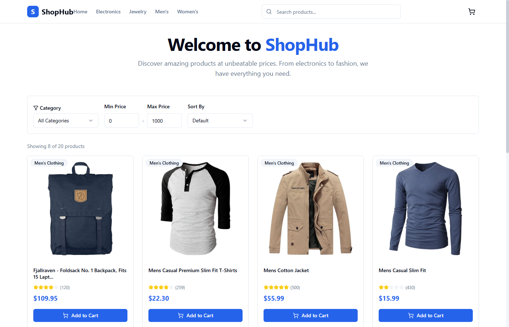
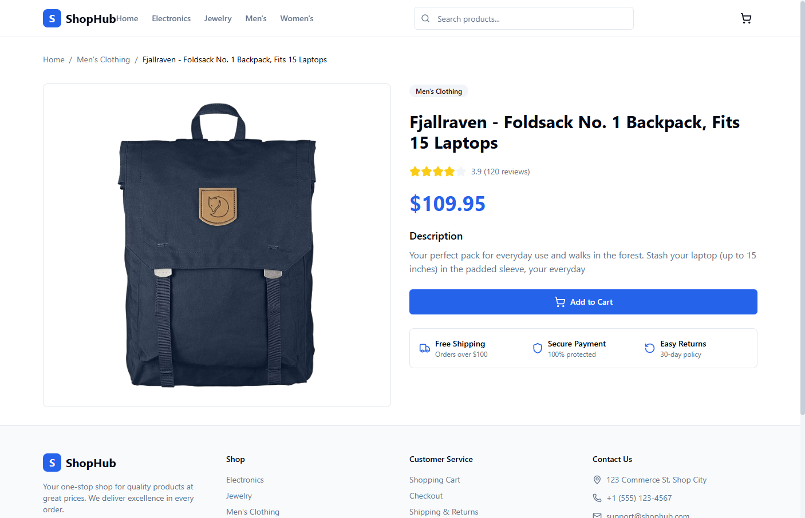
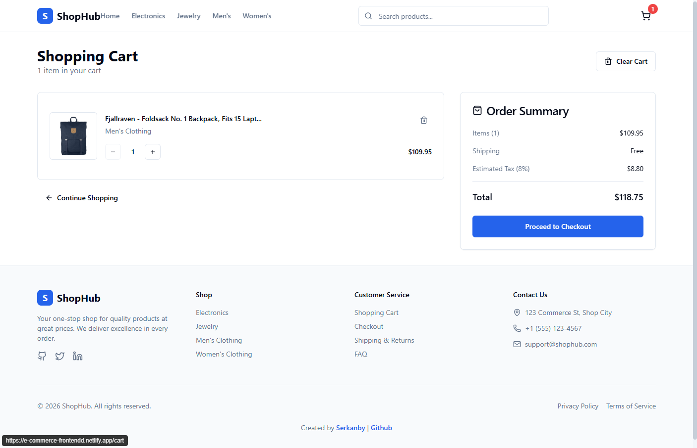
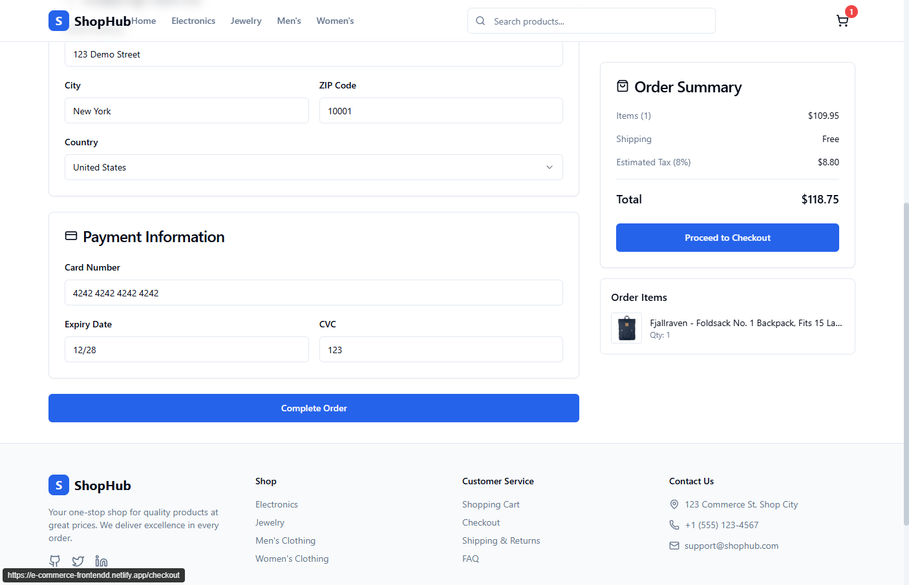

# 🛒 ShopHub - E-commerce Frontend

A modern, fully responsive e-commerce frontend application featuring product catalog with filtering and pagination, shopping cart with Redux state management, and checkout flow with form validation. Built with React 19, TypeScript, Tailwind CSS, and Vite.

[](https://serkanbayraktar.com/)
[](https://github.com/Serkanbyx)
[](LICENSE)
[](https://e-commerce-frontendd.netlify.app/)

## Live Demo

[🚀 View Live Demo](https://e-commerce-frontendd.netlify.app/)

## Screenshots

### Homepage

Product catalog with category filters, price range, sorting, search, and pagination.



### Product Detail

Single product view with image, rating, description, and add-to-cart action.



### Shopping Cart

Cart management with quantity controls, order summary, and checkout navigation.



### Checkout

Multi-section checkout form with shipping, payment validation, and order summary.



## Features

- **Product Listing**: Browse products with responsive grid layout and loading skeletons
- **Advanced Filtering**: Filter by category, price range with debounced input
- **Search Functionality**: Real-time product search across the catalog
- **Sorting Options**: Sort products by price (low/high), rating, or name
- **Pagination**: Navigate through product pages with intuitive controls
- **Product Details**: View detailed product information with images and specifications
- **Shopping Cart**: Add, remove, and update quantities with real-time calculations
- **Checkout Flow**: Complete purchase with multi-section form and validation
- **Responsive Design**: Optimized for mobile, tablet, and desktop devices
- **State Persistence**: Cart automatically saved to localStorage

## Technologies

- **React 19**: Modern React with hooks and functional components
- **TypeScript**: Type-safe development with static type checking
- **Vite**: Next-generation frontend build tool for fast development
- **Redux Toolkit**: Efficient state management with slices and async thunks
- **React Router v7**: Declarative routing for single-page applications
- **React Hook Form**: Performant form handling with minimal re-renders
- **Zod**: TypeScript-first schema validation
- **Tailwind CSS**: Utility-first CSS framework for rapid UI development
- **Lucide React**: Beautiful and consistent icon library
- **Vitest + Testing Library**: Unit and component testing
- **ESLint**: Static analysis for consistent code quality
- **FakeStore API**: RESTful API for product data

## Project Structure

```
src/
├── components/
│   ├── cart/           # CartItem, CartSummary
│   ├── checkout/       # CheckoutForm with validation
│   ├── layout/         # Header, Footer, Layout wrapper
│   ├── product/        # ProductCard, ProductGrid, ProductFilters, Pagination
│   └── ui/             # Reusable UI components (Button, Card, Input, etc.)
├── lib/
│   ├── api.ts          # FakeStore API client (centralized fetch layer)
│   ├── utils.ts        # Utility functions (cn, formatPrice)
│   └── validations.ts  # Zod validation schemas
├── pages/
│   ├── HomePage.tsx        # Product listing with filters
│   ├── ProductDetailPage.tsx   # Single product view
│   ├── CartPage.tsx        # Shopping cart
│   └── CheckoutPage.tsx    # Checkout form
├── store/
│   ├── slices/
│   │   ├── cartSlice.ts    # Cart state management
│   │   └── productSlice.ts # Product fetching and state
│   ├── hooks.ts        # Typed Redux hooks
│   └── store.ts        # Store configuration
├── test/
│   └── setup.ts        # Vitest + Testing Library setup
├── types/
│   └── index.ts        # TypeScript interfaces
├── App.tsx             # Main app with routing
├── main.tsx            # Entry point
└── index.css           # Global styles with Tailwind
```

## Build Guide

A detailed, step-by-step playbook covering how this project was built — from scaffolding to deployment — is available in [docs/build-guide.md](docs/build-guide.md).

## Installation

### Prerequisites

- Node.js 18 or higher
- npm or yarn package manager

### Local Development

1. Clone the repository:

```bash
git clone https://github.com/Serkanbyx/e-commerce-frontend.git
cd e-commerce-frontend
```

2. Install dependencies:

```bash
npm install
```

3. Start the development server:

```bash
npm run dev
```

4. Open [http://localhost:5173](http://localhost:5173) in your browser.

### Build for Production

```bash
npm run build
```

### Preview Production Build

```bash
npm run preview
```

## Usage

1. **Browse Products**: Visit the homepage to see all available products
2. **Filter & Search**: Use the sidebar filters to narrow down products by category or price range
3. **Sort Products**: Use the sort dropdown to order products by price, rating, or name
4. **View Details**: Click on any product card to see detailed information
5. **Add to Cart**: Click "Add to Cart" button to add items to your shopping cart
6. **Manage Cart**: Adjust quantities or remove items from the cart page
7. **Checkout**: Fill in shipping and payment details to complete your order

## API

This project uses the [FakeStore API](https://fakestoreapi.com/) for product data. All requests go through a single client in `src/lib/api.ts`.

The base URL is configurable via an environment variable. Copy `.env.example` to `.env` to override it:

```bash
cp .env.example .env
# VITE_API_BASE_URL=https://your-api.example.com
```

**Endpoints used:**

| Endpoint | Description |
|----------|-------------|
| `GET /products` | Fetch all products |
| `GET /products/:id` | Fetch single product by ID |
| `GET /products/categories` | Fetch all categories |

## Scripts

| Command | Description |
|---------|-------------|
| `npm run dev` | Start development server with hot reload |
| `npm run build` | Build for production (TypeScript + Vite) |
| `npm run preview` | Preview production build locally |
| `npm run lint` | Run ESLint for code quality |
| `npm run lint:fix` | Auto-fix ESLint issues |
| `npm run test` | Run the test suite once |
| `npm run test:watch` | Run tests in watch mode |

## Features in Detail

### Completed Features

✅ Product listing with responsive grid layout  
✅ Category and price range filtering  
✅ Real-time search functionality  
✅ Multiple sorting options  
✅ Pagination with configurable items per page  
✅ Product detail page with full information  
✅ Shopping cart with quantity management  
✅ LocalStorage persistence for cart  
✅ Checkout form with Zod validation  
✅ Credit card number formatting  
✅ Order confirmation flow  
✅ Loading skeletons for better UX  
✅ Empty state handling  
✅ Fully responsive design  

### Future Features

- [ ] User authentication and accounts
- [ ] Order history and tracking
- [ ] Wishlist functionality
- [ ] Product reviews and ratings
- [ ] Multiple payment methods
- [ ] Dark mode toggle

## Deployment

### Netlify

This project is configured for easy deployment to Netlify.

1. Connect your GitHub repository to Netlify
2. Build command: `npm run build`
3. Publish directory: `dist`

Or use the Netlify CLI:

```bash
npm install -g netlify-cli
netlify deploy --prod
```

## Contributing

Contributions are welcome! Please follow these steps:

1. Fork the repository
2. Create your feature branch:

```bash
git checkout -b feature/amazing-feature
```

3. Commit your changes using semantic format:

```bash
git commit -m "feat: add amazing feature"
```

4. Push to the branch:

```bash
git push origin feature/amazing-feature
```

5. Open a Pull Request

### Commit Message Format

| Prefix | Description |
|--------|-------------|
| `feat:` | New feature |
| `fix:` | Bug fix |
| `docs:` | Documentation changes |
| `style:` | Code style changes |
| `refactor:` | Code refactoring |
| `test:` | Adding tests |
| `chore:` | Maintenance tasks |

## License

This project is open source and available under the [MIT License](LICENSE).

## Developer

**Serkanby**

- Website: [serkanbayraktar.com](https://serkanbayraktar.com/)
- GitHub: [@Serkanbyx](https://github.com/Serkanbyx)
- Email: [serkanbyx1@gmail.com](mailto:serkanbyx1@gmail.com)

## Acknowledgments

- [FakeStore API](https://fakestoreapi.com/) for providing mock product data
- [shadcn/ui](https://ui.shadcn.com/) for component design inspiration
- [Tailwind CSS](https://tailwindcss.com/) for utility-first styling
- [Lucide Icons](https://lucide.dev/) for beautiful icon set
- [Redux Toolkit](https://redux-toolkit.js.org/) for efficient state management

## Contact

- **Issues**: [GitHub Issues](https://github.com/Serkanbyx/e-commerce-frontend/issues)
- **Email**: [serkanbyx1@gmail.com](mailto:serkanbyx1@gmail.com)
- **Website**: [serkanbayraktar.com](https://serkanbayraktar.com/)

---

⭐ If you like this project, don't forget to give it a star!
