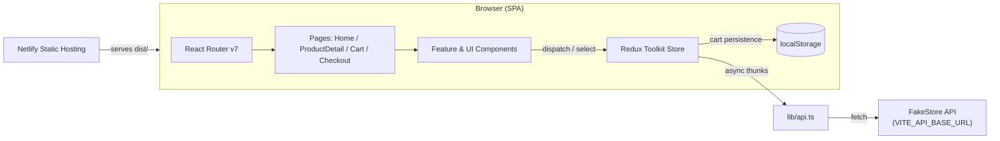

# ShopHub — Step-by-Step Build Guide

> **Archived: original build playbook.** This guide is the original roadmap used to build the ShopHub e-commerce frontend. It captures the implementation order, decisions, and patterns used while creating the app. The codebase may have evolved since this guide was written — for the current setup, architecture, and deployment notes, see [../README.md](../README.md).

---

> **Project Summary:** ShopHub is a fully responsive, single-page e-commerce storefront built with React 19 and TypeScript. It renders a product catalog backed by the FakeStore API with category/price/search filtering, multi-criteria sorting, and pagination. Shopping cart state is managed with Redux Toolkit and persisted to `localStorage`, while the checkout flow uses React Hook Form with Zod schema validation (including card-number and expiry formatting). The UI is composed from accessible shadcn-style primitives built on Radix UI and Tailwind CSS. Code quality is enforced with ESLint and a Vitest + Testing Library unit suite, and the app ships as a static bundle to Netlify.

Each step below is a self-contained prompt. Execute them in order.

Stack: React 19, TypeScript, Vite, Redux Toolkit, React Router v7, React Hook Form, Zod, Tailwind CSS, Radix UI, lucide-react, Vitest, Testing Library, ESLint.

---

## Table of Contents

**PHASE 1 — Project Foundation**

- STEP 1 — Project Scaffolding & Dependency Setup
- STEP 2 — Tailwind, PostCSS & Global Theme Tokens
- STEP 3 — Path Aliases & Core Type Definitions

**PHASE 2 — Data Layer**

- STEP 4 — API Client & Environment Configuration
- STEP 5 — Redux Store & Typed Hooks
- STEP 6 — Cart Slice (with localStorage persistence)
- STEP 7 — Product Slice (thunks, filtering, sorting, pagination)

**PHASE 3 — UI Primitives & Layout**

- STEP 8 — Shared Utilities & UI Primitives
- STEP 9 — Layout, Header & Footer

**PHASE 4 — Feature Components & Pages**

- STEP 10 — Product Catalog (card, grid, filters, pagination)
- STEP 11 — Home & Product Detail Pages
- STEP 12 — Cart Components & Cart Page
- STEP 13 — Checkout Form, Validation & Checkout Page
- STEP 14 — Routing & App Composition

**PHASE 5 — Quality & Deploy**

- STEP 15 — ESLint Setup
- STEP 16 — Vitest + Testing Library Suite
- STEP 17 — Production Build & Netlify Deployment

**Appendices**

- Appendix A — Shared Constants & Conventions
- Appendix B — Reusable Patterns
- Appendix C — Common Pitfalls
- Appendix D — Pre-flight Checklist

---

## Global Build Rules (apply to EVERY step)

- **No git operations.** Do not run `git` commands, do not stage, commit, push, branch, or tag. Version control is handled manually by the user.
- **No unapproved dependencies.** Only install packages listed in the step or already present in `package.json`. Prefer native methods over new dependencies (DRY, minimal footprint).
- **No long-running processes** (dev servers, watchers) unless the user explicitly requests them. Prefer one-shot commands such as `npm run build`, `npm run lint`, and `npm run test`.
- **Each step is self-contained.** Re-read the target files before editing and keep changes scoped to the step's intent.
- **Code quality first.** Code must be clean, readable, and typed. Identifiers in English and `camelCase`. Favor ES6+, React Hooks, and `async/await`.
- **Cross-cutting priorities.** Always weigh performance, security, and accessibility (a11y) in every change.

---

## Architecture at a Glance



The application is a purely client-side SPA. React Router drives page navigation, pages render feature components, and components read/write global state through Redux Toolkit. Product data is fetched from the FakeStore API through a single typed client (`src/lib/api.ts`); the base URL is configurable via `VITE_API_BASE_URL`. Cart state is mirrored to `localStorage` so it survives reloads. The production build is a static bundle served by Netlify.

---

# PHASE 1 — PROJECT FOUNDATION

---

## STEP 1 — Project Scaffolding & Dependency Setup

**Goal:** Establish a Vite + React + TypeScript project with the runtime dependencies the app relies on.

**Files/folders:**

- `package.json`, `vite.config.ts`, `tsconfig.json`, `tsconfig.node.json`
- `index.html`, `src/main.tsx`, `src/App.tsx`

**Dependencies (runtime):**

- `react`, `react-dom`, `react-router-dom`
- `@reduxjs/toolkit`, `react-redux`
- `react-hook-form`, `@hookform/resolvers`, `zod`
- `@radix-ui/react-dialog`, `@radix-ui/react-label`, `@radix-ui/react-select`, `@radix-ui/react-slot`, `@radix-ui/react-toast`
- `class-variance-authority`, `clsx`, `tailwind-merge`, `lucide-react`

**Dependencies (dev):** `vite`, `@vitejs/plugin-react`, `typescript`, `tailwindcss`, `postcss`, `autoprefixer`.

**Implementation notes:**

- Use `"type": "module"` and Vite scripts: `dev`, `build` (`tsc && vite build`), `preview`.
- Mount the app in `src/main.tsx` inside `<StrictMode>` and the Redux `<Provider>`.

**Acceptance:** `npm install` succeeds and `npm run dev` renders an empty shell without errors.

---

## STEP 2 — Tailwind, PostCSS & Global Theme Tokens

**Goal:** Wire up Tailwind with a design-token theme (HSL CSS variables) consumed by utility classes.

**Files/folders:** `tailwind.config.js`, `postcss.config.js`, `src/index.css`.

**Implementation notes:**

- Define semantic color tokens (`--background`, `--foreground`, `--primary`, `--muted`, `--destructive`, `--border`, `--ring`, etc.) as HSL CSS variables in `:root`, and map them in `tailwind.config.js` under `theme.extend.colors` using `hsl(var(--token))`.
- Configure `content` globs to include `index.html` and `./src/**/*.{ts,tsx}`.
- Import the stylesheet once in `src/main.tsx`.

**Acceptance:** Utility classes like `bg-primary text-primary-foreground` render with the themed palette.

---

## STEP 3 — Path Aliases & Core Type Definitions

**Goal:** Enable the `@/` import alias and define the domain types used throughout the app.

**Files/folders:** `vite.config.ts` (resolve alias), `tsconfig.json` (paths), `src/types/index.ts`.

**Implementation notes:**

- Alias `@` to `./src` in both Vite (`resolve.alias`) and TypeScript (`compilerOptions.paths`).
- Keep `strict`, `noUnusedLocals`, and `noUnusedParameters` enabled.
- Define minimal, intentional domain types: `Product`, `CartItem`, `SortOption`, `ProductFilters`. Avoid speculative interfaces — only model what the UI consumes.

```ts
export interface Product {
  id: number;
  title: string;
  price: number;
  description: string;
  category: string;
  image: string;
  rating: { rate: number; count: number };
}
```

**Acceptance:** `import { Product } from '@/types'` resolves in both editor and `tsc`.

---

# PHASE 2 — DATA LAYER

---

## STEP 4 — API Client & Environment Configuration

**Goal:** Centralize all network access in one typed client and make the base URL configurable.

**Files/folders:** `src/lib/api.ts`, `src/vite-env.d.ts`, `.env.example`.

**Implementation notes:**

- Read the base URL from `import.meta.env.VITE_API_BASE_URL`, defaulting to `https://fakestoreapi.com`.
- Provide a generic `request<T>()` wrapper that throws on non-2xx responses and parses JSON.
- Expose a `productApi` object with `getAll`, `getById`, and `getCategories`. Components and slices must never call `fetch` directly.
- Declare `VITE_API_BASE_URL` on `ImportMetaEnv` in `src/vite-env.d.ts` for type safety.
- Document the variable in `.env.example`.

**Acceptance:** A single grep for `fetch(` shows it only appears inside `src/lib/api.ts`.

---

## STEP 5 — Redux Store & Typed Hooks

**Goal:** Configure the global store and expose typed dispatch/selector hooks.

**Files/folders:** `src/store/store.ts`, `src/store/hooks.ts`.

**Implementation notes:**

- `configureStore` with `cart` and `products` reducers.
- Export `RootState` and `AppDispatch` inferred from the store.
- Export `useAppDispatch` and `useAppSelector` (`TypedUseSelectorHook<RootState>`) so components never import raw react-redux hooks.

**Acceptance:** Selectors are fully typed; no `any` leaks into components.

---

## STEP 6 — Cart Slice (with localStorage persistence)

**Goal:** Manage cart state with add/remove/update/clear operations that persist across reloads.

**Files/folders:** `src/store/slices/cartSlice.ts`.

**Implementation notes:**

- Initialize `items` from `localStorage` via a guarded `loadCartFromStorage()` (wrap in `try/catch`, return `[]` on failure).
- After every mutating reducer, call `saveCartToStorage(state.items)`.
- Reducers: `addToCart`, `removeFromCart`, `updateQuantity` (removes at `<= 0`), `incrementQuantity`, `decrementQuantity` (removes at `<= 1`), `clearCart`, `toggleCart`, `setCartOpen`.
- Provide selectors: `selectCartItems`, `selectCartTotal`, `selectCartItemCount`, `selectIsCartOpen`.

**Acceptance:** Adding items, reloading the page, and re-reading the cart shows the same contents.

---

## STEP 7 — Product Slice (thunks, filtering, sorting, pagination)

**Goal:** Fetch products/categories and derive a filtered, sorted, paginated view.

**Files/folders:** `src/store/slices/productSlice.ts`.

**Implementation notes:**

- Async thunks `fetchProducts`, `fetchProductById`, `fetchCategories` delegate to `productApi` and use `rejectWithValue` for error messages.
- Keep a pure `applyFiltersAndSort(items, filters, sortBy)` helper; call it whenever items, filters, or sort change. Reset `currentPage` to 1 on filter changes.
- Reducers: `setFilters` (partial), `setSortBy`, `setCurrentPage`, `setItemsPerPage`, `clearSelectedProduct`, `resetFilters`.
- Derived selectors: `selectPaginatedProducts`, `selectTotalPages`, plus state selectors for loading/error/filters.

**Acceptance:** Changing a filter updates the visible list and resets pagination deterministically.

---

# PHASE 3 — UI PRIMITIVES & LAYOUT

---

## STEP 8 — Shared Utilities & UI Primitives

**Goal:** Provide reusable helpers and accessible shadcn-style primitives.

**Files/folders:** `src/lib/utils.ts`, `src/components/ui/{button,card,input,label,select,badge,skeleton}.tsx`.

**Implementation notes:**

- `cn(...)` merges classes via `clsx` + `tailwind-merge`.
- Add `formatPrice` (Intl currency), `truncateText`, `debounce`, `calculateOrderSummary`, and order constants (`FREE_SHIPPING_THRESHOLD`, `SHIPPING_FEE`, `TAX_RATE`).
- Build primitives with `class-variance-authority` for variants and `React.forwardRef` for ref passthrough. Use Radix primitives for `select` and `label`.
- Free shipping is inclusive at the threshold: `subtotal >= FREE_SHIPPING_THRESHOLD`.

**Acceptance:** Primitives are keyboard-accessible and styled consistently with the theme.

---

## STEP 9 — Layout, Header & Footer

**Goal:** Provide the shared chrome (sticky header with search + cart badge, responsive nav, footer) and an `<Outlet/>` host.

**Files/folders:** `src/components/layout/{Layout,Header,Footer}.tsx`.

**Implementation notes:**

- `Layout` renders `Header`, a `<main>` with `<Outlet/>`, and `Footer`.
- `Header` shows the cart item count badge (`selectCartItemCount`), a search form that dispatches `setFilters({ search })`, category quick-links, and a mobile menu toggle.
- Use `sr-only` labels and `aria-*` attributes for icon-only buttons.

**Acceptance:** Header is sticky, responsive, and the cart badge reflects store state live.

---

# PHASE 4 — FEATURE COMPONENTS & PAGES

---

## STEP 10 — Product Catalog (card, grid, filters, pagination)

**Goal:** Render the catalog with filtering, sorting, skeleton loading, and pagination controls.

**Files/folders:** `src/components/product/{ProductCard,ProductGrid,ProductCardSkeleton,ProductFilters,Pagination}.tsx`.

**Implementation notes:**

- `ProductCard` links to the detail page, lazy-loads images, shows rating stars, and has an "Add to Cart" button that calls `e.preventDefault()` to avoid triggering the wrapping link.
- `ProductGrid` shows `ProductCardSkeleton` placeholders while loading and an empty state otherwise.
- `ProductFilters` syncs the `category` query param with the store, and debounces price updates with a `useMemo`-wrapped `debounce` (stable across renders — never wrap `debounce` in `useCallback`).
- `Pagination` renders truncated page numbers and first/prev/next/last controls with `aria-current`.

**Acceptance:** Filtering, sorting, and paging all work; price input does not dispatch on every keystroke.

---

## STEP 11 — Home & Product Detail Pages

**Goal:** Compose the landing catalog page and the single-product view.

**Files/folders:** `src/pages/HomePage.tsx`, `src/pages/ProductDetailPage.tsx`.

**Implementation notes:**

- `HomePage` dispatches `fetchProducts()` on mount, renders the hero, filters, results count, grid, and pagination.
- `ProductDetailPage` reads `:id` from the route, dispatches `fetchProductById`, and clears the selected product on unmount. Handle loading (skeletons), error, and not-found states explicitly.

**Acceptance:** Navigating to a product shows details; back navigation returns to the catalog without stale state.

---

## STEP 12 — Cart Components & Cart Page

**Goal:** Display cart line items with quantity controls and an order summary.

**Files/folders:** `src/components/cart/{CartItem,CartSummary}.tsx`, `src/pages/CartPage.tsx`.

**Implementation notes:**

- `CartItem` shows image, title, category, quantity stepper (disable decrement at 1), per-line total, and a remove button.
- `CartSummary` uses `calculateOrderSummary` and the shared `FREE_SHIPPING_THRESHOLD` for the "add X more for free shipping" notice.
- `CartPage` handles the empty-cart state and a confirm-guarded "Clear Cart" action.

**Acceptance:** Quantity edits and removals update totals and persistence immediately.

---

## STEP 13 — Checkout Form, Validation & Checkout Page

**Goal:** Collect and validate shipping/payment details with a polished success flow.

**Files/folders:** `src/lib/validations.ts`, `src/components/checkout/CheckoutForm.tsx`, `src/pages/CheckoutPage.tsx`.

**Implementation notes:**

- Define `checkoutSchema` with Zod (personal info, shipping address, payment). Transform/refine the card number; validate expiry as `MM/YY` and CVC as 3–4 digits.
- Provide `formatCardNumber` and `formatExpiryDate` helpers; apply them in controlled `onChange` handlers via `setValue`.
- Use `react-hook-form` with `zodResolver`. On submit, simulate processing, dispatch `clearCart()`, show a confirmation card, and redirect home.
- `CheckoutPage` redirects to an empty-cart state when there are no items and renders an order-items preview alongside the form.

**Acceptance:** Invalid fields show inline errors; a valid submission clears the cart and confirms the order.

---

## STEP 14 — Routing & App Composition

**Goal:** Wire all pages under a shared layout route.

**Files/folders:** `src/App.tsx`.

**Implementation notes:**

- `BrowserRouter` with a parent `Layout` route and children: index → `HomePage`, `product/:id` → `ProductDetailPage`, `cart` → `CartPage`, `checkout` → `CheckoutPage`.

**Acceptance:** All routes render within the shared header/footer chrome.

---

# PHASE 5 — QUALITY & DEPLOY

---

## STEP 15 — ESLint Setup

**Goal:** Enforce consistent, safe code with a flat ESLint config.

**Files/folders:** `eslint.config.js`, `package.json` scripts.

**Dependencies (dev):** `eslint`, `@eslint/js`, `typescript-eslint`, `eslint-plugin-react-hooks`, `eslint-plugin-react-refresh`, `globals`.

**Implementation notes:**

- Use the flat config (`tseslint.config(...)`), ignore `dist`/`coverage`/`node_modules`, and apply recommended JS + TypeScript rules plus the react-hooks and react-refresh rule sets.
- Add scripts: `"lint": "eslint ."` and `"lint:fix": "eslint . --fix"`.
- Prefer `type` aliases over empty `interface ... extends ...` to satisfy `no-empty-object-type`.

**Acceptance:** `npm run lint` exits with code 0 (informational warnings for react-hook-form `watch` and shadcn `cva` exports are acceptable).

---

## STEP 16 — Vitest + Testing Library Suite

**Goal:** Add a fast unit suite covering pure logic and reducers.

**Files/folders:** `vite.config.ts` (test block), `src/test/setup.ts`, `src/**/*.test.ts(x)`.

**Dependencies (dev):** `vitest`, `@vitest/coverage-v8`, `jsdom`, `@testing-library/react`, `@testing-library/jest-dom`, `@testing-library/user-event`.

**Implementation notes:**

- Configure Vitest in `vite.config.ts` with `globals: true`, `environment: 'jsdom'`, and `setupFiles: './src/test/setup.ts'`.
- In the setup file, import `@testing-library/jest-dom` and `cleanup()` after each test.
- Cover `lib/utils.ts` (pricing/order math, formatting), `lib/validations.ts` (schema + formatters), and `cartSlice` (reducers + selectors).
- Add scripts: `"test": "vitest run"` and `"test:watch": "vitest"`.

**Acceptance:** `npm run test` passes all suites.

---

## STEP 17 — Production Build & Netlify Deployment

**Goal:** Produce an optimized static bundle and configure SPA hosting.

**Files/folders:** `netlify.toml`, `dist/` (generated).

**Implementation notes:**

- `npm run build` runs `tsc` then `vite build`, emitting to `dist/`.
- In `netlify.toml`, set the build command to `npm run build`, the publish directory to `dist`, and add an SPA redirect (`/* -> /index.html`, status 200) so client routes resolve on refresh.
- Set `VITE_API_BASE_URL` in the Netlify environment if overriding the default API.

**Acceptance:** `npm run build` succeeds and `npm run preview` serves the production bundle with working routes.

---

# Appendix A — Shared Constants & Conventions

- **Order math constants** (in `src/lib/utils.ts`): `FREE_SHIPPING_THRESHOLD = 100`, `SHIPPING_FEE = 9.99`, `TAX_RATE = 0.08`. Reuse these everywhere instead of magic numbers.
- **Pagination default:** `itemsPerPage = 8`.
- **Filter defaults:** `category: 'all'`, `minPrice: 0`, `maxPrice: 1000`, `search: ''`, `sortBy: 'default'`.
- **Naming:** English, descriptive, `camelCase` for variables/functions and `PascalCase` for components/types.
- **Imports:** always use the `@/` alias for `src` modules.

# Appendix B — Reusable Patterns

- **Single transport layer:** all HTTP goes through `productApi` in `src/lib/api.ts`.
- **Typed Redux access:** only use `useAppDispatch` / `useAppSelector`.
- **Derived state in selectors:** pagination and totals are computed in selectors, not components.
- **Stable debounced callbacks:** wrap `debounce(...)` in `useMemo`, keyed on `dispatch`.
- **Controlled formatting inputs:** format card number/expiry in `onChange` and write back with `setValue`.
- **Accessible icon buttons:** pair every icon-only control with `aria-label` or `sr-only` text.

# Appendix C — Common Pitfalls

- **`useCallback(debounce(...))`** creates a new debounced function each render, defeating the debounce. Use `useMemo`.
- **Empty `interface` extending a type** trips `@typescript-eslint/no-empty-object-type`; use a `type` alias.
- **Calling `fetch` in components/slices** breaks the transport abstraction and env-based base URL; route through `productApi`.
- **Inconsistent free-shipping checks** (`> 100` vs `>= 100`) cause off-by-one UX at exactly the threshold; use the shared constant with `>=`.
- **Forgetting `e.preventDefault()`** on the in-card "Add to Cart" button triggers the wrapping product link.
- **Mutating cart without persisting** leaves `localStorage` out of sync; always call `saveCartToStorage`.

# Appendix D — Pre-flight Checklist

- [ ] `npm install` completes cleanly.
- [ ] `npm run lint` exits 0 (only known informational warnings remain).
- [ ] `npm run test` passes all suites.
- [ ] `npm run build` succeeds (`tsc` + `vite build`).
- [ ] `npm run preview` serves the app and client-side routes resolve on refresh.
- [ ] Cart persists across reloads; checkout validation blocks invalid input.
- [ ] `VITE_API_BASE_URL` documented in `.env.example` and set in the hosting environment if overridden.
